# SPEC_SHEET.md — Quantum Badger  
**Part 1 of 12 — Title & Architecture Overview**

---

## 1. Product overview

**Quantum Badger** is a **local‑first, privacy‑first AI assistant for macOS** that:

- **Prefers on‑device execution** (Apple Intelligence, local tools) and only uses **Apple‑approved ChatGPT** when explicitly allowed.  
- Enforces a **RiskLevel model** (Standard vs Advanced) that controls which tools, data, and behaviors are allowed.  
- Embeds **security guardrails** (web/file filtering, privacy egress filtering, audit logging, thermal/rate limiting) into the core architecture.  
- Targets **non‑technical, premium users** with clear consent flows, readable warnings, and safe defaults.

The app is structured as a **three‑layer architecture**:

- **BadgerApp Layer** — SwiftUI, screen‑scoped state models, AppCoordinator, Siri/AppIntents.  
- **BadgerRuntime Layer** — actors for web, files, memory, execution, thermal, and rate limiting.  
- **BadgerCore Layer** — policies, privacy filters, cryptography, and audit logging.

---

## 2. Architecture overview

### 2.1 Three‑layer architecture (mermaid)

```mermaid
flowchart TD

    subgraph BadgerApp["BadgerApp Layer"]
        UI["Security Center UI"]
        Siri["AppIntents (Siri)"]
        Dashboard["Enhanced Dashboard"]
        RiskUI["Risk Level Controls\n(Standard / Advanced)"]
        Consent["User Consent & Warnings"]
    end

    subgraph Runtime["BadgerRuntime Layer"]
        Web["WebBrowserService\n• Strict/Whitelist Web Filtering\n• Script/Obfuscation Blocking\n• Sanitized Text Extraction"]
        Files["FileManagerService\n• Sandboxed File Access\n• Magic Number Validation\n• HTML/JSON Sanitization"]
        Memory["ConversationMemoryManager\n• AES‑GCM Encryption\n• Integrity Hashing\n• Retention & Compaction"]
        Thermal["EnhancedThermalGuard\n• Thermal/Load Monitoring\n• Throttle Recommendations"]
        Exec["HybridExecutionManager\n• Local‑First Execution\n• Apple‑Approved ChatGPT Mode\n• Cloud Fallback w/ Consent"]
        Rate["RateLimiter\n• Token Buckets for Local/Cloud"]
    end

    subgraph Core["BadgerCore Layer"]
        Policy["SecurityPolicy\n• Web/File/Privacy/Conversation\n• ExecutionPolicy\n• RiskLevel (Standard/Advanced)"]
        Egress["PrivacyEgressFilter\n• PII/PHI Detection\n• Threshold Blocking\n• Redaction Modes"]
        Crypto["Cryptographic Primitives\n• AES‑GCM\n• SHA‑256\n• Secure Enclave Keys"]
        Audit["AuditLogService\n• Signed Audit Trail\n• Policy Changes\n• Blocked Actions"]
    end

    BadgerApp --> Runtime --> Core
```



---

### 2.2 Layer responsibilities

- **BadgerApp Layer**
  - **SwiftUI screens** with screen‑scoped `@Observable` models (mix of `State` and `ViewModel` naming).
  - **AppCoordinator (@MainActor)** orchestrates all flows between UI and runtime actors.
  - **RiskLevel controls** and **consent UI** for Standard vs Advanced behavior.
  - **AppIntents/Siri** integration that routes through AppCoordinator (never directly to runtime actors).

- **BadgerRuntime Layer**
  - **Actors** encapsulating side‑effects and I/O:
    - `WebBrowserService` — strict web access, whitelist/blacklist, script blocking, text‑only extraction.
    - `FileManagerService` — sandboxed file access, magic‑number validation, safe parsing.
    - `ConversationMemoryManager` — encrypted, integrity‑checked conversation storage.
    - `HybridExecutionManager` — local‑first vs Apple‑approved ChatGPT selection.
    - `EnhancedThermalGuard` — thermal/load monitoring and recommendations.
    - `RateLimiter` — token‑bucket limits for local and cloud usage.
  - All APIs are **async** and **actor‑isolated**.

- **BadgerCore Layer**
  - **SecurityPolicy** — immutable snapshot of current policies (web, file, privacy, execution, RiskLevel).
  - **PrivacyEgressFilter** — PII/PHI detection, redaction, and blocking before any cloud call.
  - **Cryptographic primitives** — AES‑GCM, SHA‑256, Secure Enclave key management.
  - **AuditLogService** — signed, append‑only audit trail for sensitive actions and policy changes.

---

### 2.3 High‑level data & control flow

At a high level, **all user actions** follow this pattern:

1. **User interacts with SwiftUI screen**  
   - Bound to a **screen‑scoped `@Observable` state model** (e.g., `SecurityCenterState`, `ConversationListViewModel`).

2. **Screen state model calls AppCoordinator (@MainActor)**  
   - Functions like `processIntent`, `openURL`, `summarizeFile`, `toggleAdvancedMode`.

3. **AppCoordinator consults BadgerCore**  
   - Reads **SecurityPolicy** snapshot.  
   - Applies **RiskLevel** rules (Standard vs Advanced).  
   - Uses **PrivacyEgressFilter** and **ExecutionPolicy** to decide allowed actions.

4. **AppCoordinator calls runtime actors (async)**  
   - `WebBrowserService`, `FileManagerService`, `HybridExecutionManager`, etc.  
   - All cross‑actor calls are `await` and may `throw`.

5. **Runtime actors return structured results**  
   - `AssistantResponse`, `SanitizedPage`, `SanitizedFileContent`, etc.

6. **AppCoordinator updates screen‑scoped state models (@MainActor)**  
   - State models mutate synchronously on the main actor.  
   - SwiftUI re‑renders views.

7. **AuditLogService records sensitive events**  
   - Policy changes, blocked actions, cloud usage, RiskLevel changes.

---

### 2.4 Core design principles

- **Local‑first by default**  
  - All execution prefers on‑device models and tools.  
  - Apple‑approved ChatGPT is only used when allowed by **RiskLevel** and **user consent**.

- **RiskLevel as a first‑class concept**  
  - **Standard**: strict web/file access, no arbitrary code, minimal data egress.  
  - **Advanced**: more powerful tools, but with explicit warnings and visible toggles.

- **Guardrails embedded in architecture**  
  - Web/file filtering, privacy egress filtering, audit logging, thermal/rate limiting are **not optional add‑ons**—they are core modules.

- **Screen‑scoped state models**  
  - Each screen has its own `@Observable` state or view model.  
  - AppCoordinator owns and updates them, ensuring a single orchestration point.

- **Swift 2026‑compliant concurrency**  
  - `@MainActor` for UI and AppCoordinator.  
  - Actors for all side‑effectful services.  
  - `async`/`await` for all cross‑actor calls.  
  - SwiftData `@Model` for persisted entities with explicit `UUID` IDs.

---
## Part 2 of 12 — Security Model

### Risk levels

**Standard**  
- Local‑first execution only  
- Apple‑approved ChatGPT allowed only after explicit per‑request consent  
- Strict web filtering (whitelist + script stripping)  
- Strict file filtering (magic‑number validation, safe parsers only)  
- No arbitrary code execution  
- No tool chaining  
- Privacy egress filtering required for all outbound text  
- Audit logging enabled for all sensitive actions  

**Advanced**  
- Everything in Standard  
- Expanded tool access (web, files, system info)  
- Multi‑step tool chaining allowed  
- Cloud execution allowed without repeated prompts, but still requires initial consent  
- Higher rate limits  
- Additional warnings surfaced in UI  

RiskLevel is immutable during a single request cycle. AppCoordinator reads a snapshot at the start of each operation.

```swift
enum RiskLevel: String, Codable {
    case standard
    case advanced
}
```

---

### Execution policy

ExecutionPolicy determines which execution paths are allowed based on RiskLevel and user consent.

```swift
struct ExecutionPolicy: Codable {
    let riskLevel: RiskLevel
    let allowLocal: Bool
    let allowCloud: Bool
    let requireEgressFiltering: Bool
    let requireConsentForCloud: Bool
}
```

Policy is read‑only at runtime and stored in SwiftData via SecurityPolicy.

---

### Security policy

SecurityPolicy is the authoritative snapshot of all security‑related settings. It is stored in SwiftData and read by AppCoordinator before any operation.

```swift
@Model
final class SecurityPolicy {
    @Attribute(.unique) var id: UUID
    var riskLevel: RiskLevel
    var allowWebAccess: Bool
    var allowFileAccess: Bool
    var allowCloudExecution: Bool
    var allowAdvancedTools: Bool
    var lastUpdated: Date
}
```

SecurityPolicy is never mutated directly by runtime actors. All updates occur through AppCoordinator on the main actor.

---

### Privacy egress filtering

PrivacyEgressFilter is an actor that inspects outbound text before cloud execution. It blocks or redacts PII/PHI depending on policy.

```swift
actor PrivacyEgressFilter {
    func validateOutput(_ text: String, policy: ExecutionPolicy) async throws -> SanitizedText
}
```

SanitizedText is a structured result:

```swift
struct SanitizedText {
    let text: String
    let redacted: Bool
    let blocked: Bool
    let findings: [PrivacyFinding]
}
```

PrivacyFinding describes detected sensitive content:

```swift
struct PrivacyFinding: Codable {
    let type: String
    let range: Range<String.Index>
}
```

If `blocked == true`, AppCoordinator stops the request and updates UI state with a warning.

---

### Web filtering

WebBrowserService enforces strict filtering:

- Only HTTP(S)  
- No JavaScript execution  
- No iframes, embeds, or scripts  
- No binary downloads  
- No cross‑site redirects  
- Only text extraction allowed  

```swift
actor WebBrowserService {
    func fetch(_ url: URL, policy: SecurityPolicy) async throws -> SanitizedPage
}
```

SanitizedPage contains only safe text:

```swift
struct SanitizedPage {
    let url: URL
    let title: String
    let textContent: String
}
```

---

### File filtering

FileManagerService validates all files before reading:

- Magic‑number validation  
- Size limits  
- Safe parsers only (JSON, TXT, Markdown, PDF text extraction)  
- No HTML rendering  
- No script execution  

```swift
actor FileManagerService {
    func readFile(at url: URL, policy: SecurityPolicy) async throws -> SanitizedFileContent
}
```

SanitizedFileContent:

```swift
struct SanitizedFileContent {
    let url: URL
    let textContent: String
    let fileType: String
}
```

---

### Audit logging

AuditLogService records sensitive events:

- Policy changes  
- RiskLevel changes  
- Cloud execution  
- Blocked actions  
- File or web access attempts  

```swift
@Model
final class AuditLogEntry {
    @Attribute(.unique) var id: UUID
    var timestamp: Date
    var category: String
    var message: String
    var metadata: [String: String]
}
```

AuditLogService is an actor:

```swift
actor AuditLogService {
    func record(_ entry: AuditLogEntry) async
}
```

AppCoordinator writes logs synchronously on the main actor by calling the actor asynchronously.

---

### Thermal and rate limiting

EnhancedThermalGuard prevents runaway workloads:

```swift
actor EnhancedThermalGuard {
    func currentState() async -> ThermalState
}
```

RateLimiter enforces token‑bucket limits:

```swift
actor RateLimiter {
    func consume(tokens: Int, bucket: RateBucket) async throws
}
```

---

### ASCII concurrency flow: security enforcement

```
SwiftUI Screen
    │
    ▼
ScreenState / ViewModel (@Observable)
    │ calls async
    ▼
AppCoordinator (@MainActor)
    │
    ├── read SecurityPolicy (sync)
    ├── build ExecutionPolicy (sync)
    │
    ├── await PrivacyEgressFilter.validateOutput()   (actor hop)
    ├── await EnhancedThermalGuard.currentState()    (actor hop)
    ├── await RateLimiter.consume()                  (actor hop)
    │
    └── await HybridExecutionManager.execute()       (actor hop)
            │
            ├── local path → runLocalInference()
            └── cloud path → runCloudInference()
    ▼
AppCoordinator updates ScreenState (sync)
    ▼
SwiftUI re-renders
```

---
## Part 3 of 12 — Core Modules

### SecurityPolicy

SecurityPolicy is the authoritative, persisted configuration for all security‑related behavior. It is stored in SwiftData using explicit UUID identifiers and read synchronously by AppCoordinator at the start of every operation.

```swift
@Model
final class SecurityPolicy {
    @Attribute(.unique) var id: UUID
    var riskLevel: RiskLevel
    var allowWebAccess: Bool
    var allowFileAccess: Bool
    var allowCloudExecution: Bool
    var allowAdvancedTools: Bool
    var lastUpdated: Date
}
```

SecurityPolicy is immutable during a request cycle. AppCoordinator constructs an ExecutionPolicy from it:

```swift
struct ExecutionPolicy: Codable {
    let riskLevel: RiskLevel
    let allowLocal: Bool
    let allowCloud: Bool
    let requireEgressFiltering: Bool
    let requireConsentForCloud: Bool
}
```

ExecutionPolicy is passed to runtime actors for enforcement.

---

### PrivacyEgressFilter

PrivacyEgressFilter is an actor responsible for inspecting outbound text before any cloud execution. It detects PII/PHI, applies redaction rules, and can block requests entirely.

```swift
actor PrivacyEgressFilter {
    func validateOutput(_ text: String, policy: ExecutionPolicy) async throws -> SanitizedText
}
```

SanitizedText is a structured result:

```swift
struct SanitizedText: Codable {
    let text: String
    let redacted: Bool
    let blocked: Bool
    let findings: [PrivacyFinding]
}
```

PrivacyFinding describes detected sensitive content:

```swift
struct PrivacyFinding: Codable {
    let type: String
    let rangeStart: Int
    let rangeEnd: Int
}
```

If `blocked == true`, AppCoordinator halts the request and updates the relevant screen‑scoped state model.

---

### Cryptographic primitives

BadgerCore provides cryptographic utilities for encryption, hashing, and key management. These are pure Swift functions and do not perform I/O.

```swift
enum Crypto {
    static func encrypt(_ data: Data, using key: SymmetricKey) throws -> Data
    static func decrypt(_ data: Data, using key: SymmetricKey) throws -> Data
    static func hash(_ data: Data) -> Data
}
```

ConversationMemoryManager uses AES‑GCM for encryption and SHA‑256 for integrity hashing. Keys are stored in the Secure Enclave when available.

---

### AuditLogService

AuditLogService records sensitive events such as policy changes, blocked actions, cloud usage, and RiskLevel transitions. It is an actor that writes to SwiftData.

```swift
@Model
final class AuditLogEntry {
    @Attribute(.unique) var id: UUID
    var timestamp: Date
    var category: String
    var message: String
    var metadata: [String: String]
}
```

Actor interface:

```swift
actor AuditLogService {
    func record(_ entry: AuditLogEntry) async
}
```

AppCoordinator constructs AuditLogEntry on the main actor and sends it to AuditLogService asynchronously.

---

### ASCII concurrency flow: Core module interaction

```
AppCoordinator (@MainActor)
    │
    ├── read SecurityPolicy (sync)
    │       │
    │       ▼
    │   ExecutionPolicy (sync)
    │
    ├── await PrivacyEgressFilter.validateOutput()   (actor hop)
    │
    ├── Crypto.encrypt/decrypt/hash (sync, pure)
    │
    └── await AuditLogService.record()               (actor hop)
```

Core modules never call each other directly. AppCoordinator orchestrates all interactions.

---
## Part 4 of 12 — Runtime Modules

### HybridExecutionManager

HybridExecutionManager is the central execution actor. It selects between local execution and Apple‑approved ChatGPT based on ExecutionPolicy, RiskLevel, and user consent.

```swift
actor HybridExecutionManager {
    func execute(_ request: ExecutionRequest, policy: ExecutionPolicy) async throws -> ExecutionResult
}
```

ExecutionRequest captures the user’s intent and context:

```swift
struct ExecutionRequest: Codable {
    let conversationID: UUID?
    let prompt: String
    let allowCloud: Bool
    let metadata: [String: String]
}
```

ExecutionResult is a structured response:

```swift
struct ExecutionResult: Codable {
    let response: AssistantResponse
    let usedCloud: Bool
}
```

Local execution is attempted first. Cloud execution is only used if allowed by policy and consent.

---

### WebBrowserService

WebBrowserService performs strictly filtered web access. It enforces whitelist/blacklist rules, strips scripts, blocks redirects, and extracts text only.

```swift
actor WebBrowserService {
    func fetch(_ url: URL, policy: SecurityPolicy) async throws -> SanitizedPage
}
```

SanitizedPage contains only safe text:

```swift
struct SanitizedPage: Codable {
    let url: URL
    let title: String
    let textContent: String
}
```

WebBrowserService never returns raw HTML.

---

### FileManagerService

FileManagerService provides sandboxed file access with strict validation:

- Magic‑number validation  
- Size limits  
- Safe parsers only (JSON, TXT, Markdown, PDF text extraction)  
- No HTML rendering  
- No script execution  

```swift
actor FileManagerService {
    func readFile(at url: URL, policy: SecurityPolicy) async throws -> SanitizedFileContent
}
```

SanitizedFileContent:

```swift
struct SanitizedFileContent: Codable {
    let url: URL
    let textContent: String
    let fileType: String
}
```

---

### ConversationMemoryManager

ConversationMemoryManager stores encrypted conversation history using SwiftData. It handles encryption, integrity hashing, and retention.

```swift
actor ConversationMemoryManager {
    func addMessage(_ message: Message, to conversationID: UUID) async throws
    func loadConversation(_ id: UUID) async throws -> Conversation
    func listConversations() async throws -> [Conversation]
}
```

SwiftData models:

```swift
@Model
final class Conversation {
    @Attribute(.unique) var id: UUID
    var title: String
    var createdAt: Date
    var updatedAt: Date
    @Relationship(deleteRule: .cascade) var messages: [Message]
}

@Model
final class Message {
    @Attribute(.unique) var id: UUID
    var role: String
    var content: String
    var timestamp: Date
}
```

All message content is encrypted before storage.

---

### EnhancedThermalGuard

EnhancedThermalGuard monitors system thermal state and load. It prevents runaway workloads and throttles execution when necessary.

```swift
actor EnhancedThermalGuard {
    func currentState() async -> ThermalState
}
```

ThermalState is a simple struct:

```swift
struct ThermalState: Codable {
    let level: String
    let temperature: Double
    let throttlingRecommended: Bool
}
```

---

### RateLimiter

RateLimiter enforces token‑bucket limits for local and cloud execution.

```swift
actor RateLimiter {
    func consume(tokens: Int, bucket: RateBucket) async throws
}
```

RateBucket identifies the resource:

```swift
enum RateBucket: String, Codable {
    case localExecution
    case cloudExecution
    case webAccess
    case fileAccess
}
```

If a bucket is empty, RateLimiter throws and AppCoordinator updates UI state with a warning.

---

### ASCII concurrency flow: Runtime module interaction

```
AppCoordinator (@MainActor)
    │
    ├── await RateLimiter.consume()                  (actor hop)
    ├── await EnhancedThermalGuard.currentState()    (actor hop)
    │
    ├── if web → await WebBrowserService.fetch()     (actor hop)
    ├── if file → await FileManagerService.readFile() (actor hop)
    │
    ├── build ExecutionRequest (sync)
    └── await HybridExecutionManager.execute()       (actor hop)
            │
            ├── local path → runLocalInference()
            └── cloud path → runCloudInference()
    ▼
AppCoordinator updates ScreenState (sync)
```

Runtime actors never call each other directly. All orchestration flows through AppCoordinator.

---
## Part 5 of 12 — App Layer Modules

### AppCoordinator (@MainActor)

AppCoordinator is the central orchestrator for all UI‑initiated actions. It owns all screen‑scoped state models, reads SecurityPolicy synchronously, performs all cross‑actor calls, and updates UI state on the main actor.

```swift
@MainActor
final class AppCoordinator {
    let securityCenterState: SecurityCenterState
    let conversationListViewModel: ConversationListViewModel
    let conversationDetailViewModel: ConversationDetailViewModel
    let systemStatusState: SystemStatusState
    let appSettingsState: AppSettingsState

    func processIntent(_ text: String, conversationID: UUID?) async -> AssistantResponse
    func openURL(_ url: URL) async
    func summarizeFile(at url: URL) async
    func toggleRiskLevel(_ level: RiskLevel)
    func applyPolicyUpdate(_ update: SecurityPolicyUpdate)
}
```

AppCoordinator never performs I/O directly. All side effects occur through runtime actors.

---

### Screen‑scoped state models (Option C naming)

Simple screens use `State`. Complex screens use `ViewModel`.

#### SecurityCenterState

```swift
@Observable
final class SecurityCenterState {
    var riskLevel: RiskLevel = .standard
    var warnings: [String] = []
    var recentAuditEvents: [AuditLogEntry] = []
}
```

#### ConversationListViewModel

```swift
@Observable
final class ConversationListViewModel {
    var conversations: [Conversation] = []
    var isLoading: Bool = false

    func refresh() async
}
```

#### ConversationDetailViewModel

```swift
@Observable
final class ConversationDetailViewModel {
    var messages: [Message] = []
    var inputText: String = ""
    var isProcessing: Bool = false

    func sendMessage() async
}
```

#### SystemStatusState

```swift
@Observable
final class SystemStatusState {
    var thermalState: ThermalState?
    var rateLimitWarnings: [String] = []
}
```

#### AppSettingsState

```swift
@Observable
final class AppSettingsState {
    var allowCloudExecution: Bool = false
    var allowWebAccess: Bool = false
    var allowFileAccess: Bool = false
}
```

All state mutations occur on the main actor through AppCoordinator.

---

### AppIntents / Siri integration

AppIntents route through AppCoordinator. They never call runtime actors directly.

```swift
struct ProcessIntent: AppIntent {
    @Parameter var text: String

    func perform() async throws -> some IntentResult {
        let coordinator = AppCoordinator.shared
        let response = await coordinator.processIntent(text, conversationID: nil)
        return .result(value: response.text)
    }
}
```

Siri requests follow the same security model as UI requests.

---

### UI flow and state propagation

SwiftUI views bind to screen‑scoped state models. When a user interacts with a view, the state model calls AppCoordinator, which performs async work and updates state synchronously.

```
SwiftUI View
    │ reads/writes
    ▼
ScreenState / ViewModel (@Observable)
    │ calls async
    ▼
AppCoordinator (@MainActor)
    │
    ├── read SecurityPolicy (sync)
    ├── build ExecutionPolicy (sync)
    │
    ├── await runtime actors (actor hops)
    │
    └── update ScreenState (sync)
    ▼
SwiftUI re-renders
```

---

### AppCoordinator orchestration flow (detailed concurrency)

```
User Action
    │
    ▼
ScreenState / ViewModel
    │ async call
    ▼
AppCoordinator (@MainActor)
    │
    ├── read SecurityPolicy (sync)
    ├── build ExecutionPolicy (sync)
    │
    ├── await PrivacyEgressFilter.validateOutput()   (actor hop)
    ├── await EnhancedThermalGuard.currentState()    (actor hop)
    ├── await RateLimiter.consume()                  (actor hop)
    │
    ├── if web → await WebBrowserService.fetch()     (actor hop)
    ├── if file → await FileManagerService.readFile() (actor hop)
    │
    └── await HybridExecutionManager.execute()       (actor hop)
            │
            ├── local path → runLocalInference()
            └── cloud path → runCloudInference()
    ▼
AppCoordinator updates ScreenState (sync)
    ▼
SwiftUI updates UI
```

---

### AppCoordinator responsibilities summary

- Owns all screen‑scoped state models  
- Reads SecurityPolicy and constructs ExecutionPolicy  
- Performs all cross‑actor calls  
- Applies privacy, thermal, and rate‑limit checks  
- Updates UI state synchronously  
- Records audit events  
- Routes Siri/AppIntents  

---

## Part 6 of 12 — Feature Deep‑Dive

### Web search (strict, text‑only)

Web search is implemented through `WebBrowserService.fetch`, which enforces strict filtering:

- Only HTTP/HTTPS  
- No JavaScript execution  
- No iframes, embeds, or scripts  
- No binary downloads  
- No cross‑site redirects  
- Only text extraction returned  

Flow:

```
User → ConversationDetailViewModel.sendMessage()
    → AppCoordinator.processIntent()
        → RateLimiter.consume(webAccess)
        → WebBrowserService.fetch()
        → SanitizedPage returned
        → HybridExecutionManager.execute() with page text
        → AppCoordinator updates messages
```

Function signatures:

```swift
actor WebBrowserService {
    func fetch(_ url: URL, policy: SecurityPolicy) async throws -> SanitizedPage
}
```

---

### File summarization (sandboxed, validated)

File summarization uses `FileManagerService.readFile` with strict validation:

- Magic‑number validation  
- Size limits  
- Safe parsers only (JSON, TXT, Markdown, PDF text extraction)  
- No HTML rendering  
- No script execution  

Flow:

```
User selects file
    → ConversationDetailViewModel.sendMessage()
        → AppCoordinator.summarizeFile()
            → RateLimiter.consume(fileAccess)
            → FileManagerService.readFile()
            → SanitizedFileContent returned
            → HybridExecutionManager.execute() with file text
            → AppCoordinator updates messages
```

Function signatures:

```swift
actor FileManagerService {
    func readFile(at url: URL, policy: SecurityPolicy) async throws -> SanitizedFileContent
}
```

---

### Conversation memory (encrypted, integrity‑checked)

ConversationMemoryManager stores encrypted messages using SwiftData. All message content is encrypted before storage and decrypted on load.

Flow:

```
User sends message
    → AppCoordinator.processIntent()
        → HybridExecutionManager.execute()
        → ConversationMemoryManager.addMessage()
        → AppCoordinator updates ConversationDetailViewModel
```

Function signatures:

```swift
actor ConversationMemoryManager {
    func addMessage(_ message: Message, to conversationID: UUID) async throws
    func loadConversation(_ id: UUID) async throws -> Conversation
    func listConversations() async throws -> [Conversation]
}
```

SwiftData models:

```swift
@Model
final class Conversation {
    @Attribute(.unique) var id: UUID
    var title: String
    var createdAt: Date
    var updatedAt: Date
    @Relationship(deleteRule: .cascade) var messages: [Message]
}

@Model
final class Message {
    @Attribute(.unique) var id: UUID
    var role: String
    var content: String
    var timestamp: Date
}
```

---

### Cloud fallback (Apple‑approved ChatGPT)

Cloud execution is only used when:

- RiskLevel allows it  
- SecurityPolicy allows it  
- User has granted consent  
- PrivacyEgressFilter approves the outbound text  

Flow:

```
AppCoordinator.processIntent()
    → ExecutionPolicy.allowCloud == true?
    → PrivacyEgressFilter.validateOutput()
    → RateLimiter.consume(cloudExecution)
    → HybridExecutionManager.execute()
            → runCloudInference()
    → AppCoordinator updates UI
```

ExecutionResult:

```swift
struct ExecutionResult: Codable {
    let response: AssistantResponse
    let usedCloud: Bool
}
```

---

### Advanced mode behaviors

Advanced mode expands capabilities but still enforces guardrails.

Enabled features:

- Multi‑step tool chaining  
- Broader web access (still filtered)  
- Broader file access (still validated)  
- Cloud execution without repeated prompts  
- Higher rate limits  

Disabled features:

- Arbitrary code execution  
- Raw HTML or script execution  
- Unfiltered web access  
- Unfiltered file access  

Flow:

```
User toggles Advanced Mode
    → AppCoordinator.toggleRiskLevel(.advanced)
        → SecurityPolicy updated
        → AuditLogService.record()
        → SecurityCenterState updated
```

---

### Siri/AppIntents integration

Siri requests follow the same security model as UI requests.

Flow:

```
Siri → AppIntent.perform()
    → AppCoordinator.processIntent()
        → SecurityPolicy read
        → PrivacyEgressFilter.validateOutput()
        → HybridExecutionManager.execute()
        → AppCoordinator updates state
```

Example:

```swift
struct ProcessIntent: AppIntent {
    @Parameter var text: String

    func perform() async throws -> some IntentResult {
        let coordinator = AppCoordinator.shared
        let response = await coordinator.processIntent(text, conversationID: nil)
        return .result(value: response.text)
    }
}
```

---

### Enhanced Dashboard (system status + guardrails)

The dashboard aggregates:

- Thermal state  
- Rate‑limit status  
- Recent audit events  
- RiskLevel  
- Policy configuration  

Flow:

```
DashboardView
    → SystemStatusState (thermal, rate limits)
    → SecurityCenterState (risk level, warnings)
    → AuditLogService (recent events)
```

AppCoordinator updates these states whenever:

- A request is processed  
- A policy changes  
- A thermal warning occurs  
- A rate‑limit is hit  

---

### ASCII flow: Full feature pipeline

```
User Action
    │
    ▼
ScreenState / ViewModel
    │ async call
    ▼
AppCoordinator (@MainActor)
    │
    ├── read SecurityPolicy (sync)
    ├── build ExecutionPolicy (sync)
    │
    ├── await PrivacyEgressFilter.validateOutput()   (actor hop)
    ├── await EnhancedThermalGuard.currentState()    (actor hop)
    ├── await RateLimiter.consume()                  (actor hop)
    │
    ├── if web → await WebBrowserService.fetch()     (actor hop)
    ├── if file → await FileManagerService.readFile() (actor hop)
    │
    └── await HybridExecutionManager.execute()       (actor hop)
            │
            ├── local path → runLocalInference()
            └── cloud path → runCloudInference()
    ▼
AppCoordinator updates:
    - ConversationDetailViewModel
    - ConversationListViewModel
    - SecurityCenterState
    - SystemStatusState
    - AppSettingsState
    ▼
SwiftUI re-renders
```

---

## Part 7 of 12 — Execution Flow (Detailed Concurrency & State Diagrams)

### Overview

Execution flow describes how every major operation moves through:

- Screen‑scoped state models (`@Observable`)
- AppCoordinator (`@MainActor`)
- Core modules (SecurityPolicy, PrivacyEgressFilter)
- Runtime actors (WebBrowserService, FileManagerService, HybridExecutionManager, ConversationMemoryManager, EnhancedThermalGuard, RateLimiter)
- SwiftData persistence
- UI state updates

All flows follow the same invariant:

**UI → State Model → AppCoordinator → Core Checks → Runtime Actors → AppCoordinator → State Model → UI**

---

## Intent Processing Flow (Primary Pipeline)

```
User types message
    │
    ▼
ConversationDetailViewModel.sendMessage() (@Observable)
    │ async call
    ▼
AppCoordinator.processIntent() (@MainActor)
    │
    ├── read SecurityPolicy (sync)
    ├── build ExecutionPolicy (sync)
    │
    ├── await PrivacyEgressFilter.validateOutput()     (actor hop)
    ├── await EnhancedThermalGuard.currentState()      (actor hop)
    ├── await RateLimiter.consume(localExecution)      (actor hop)
    │
    ├── if web content needed:
    │         await WebBrowserService.fetch()          (actor hop)
    │
    ├── if file content needed:
    │         await FileManagerService.readFile()      (actor hop)
    │
    └── await HybridExecutionManager.execute()         (actor hop)
            │
            ├── local path → runLocalInference()
            └── cloud path → runCloudInference()
    ▼
AppCoordinator updates ConversationDetailViewModel (sync)
    ▼
SwiftUI re-renders
```

---

## Web Search Flow (Strict Text‑Only)

```
User requests web info
    │
    ▼
ConversationDetailViewModel
    │ async call
    ▼
AppCoordinator.openURL()
    │
    ├── read SecurityPolicy (sync)
    ├── require allowWebAccess == true
    │
    ├── await RateLimiter.consume(webAccess)
    ├── await EnhancedThermalGuard.currentState()
    │
    └── await WebBrowserService.fetch()
            │
            ├── validate URL scheme
            ├── block redirects
            ├── strip scripts
            ├── extract text only
            └── return SanitizedPage
    ▼
AppCoordinator passes text to HybridExecutionManager.execute()
    ▼
AppCoordinator updates ConversationDetailViewModel
    ▼
SwiftUI updates UI
```

---

## File Summarization Flow (Sandboxed + Validated)

```
User selects file
    │
    ▼
ConversationDetailViewModel
    │ async call
    ▼
AppCoordinator.summarizeFile()
    │
    ├── read SecurityPolicy (sync)
    ├── require allowFileAccess == true
    │
    ├── await RateLimiter.consume(fileAccess)
    ├── await EnhancedThermalGuard.currentState()
    │
    └── await FileManagerService.readFile()
            │
            ├── magic-number validation
            ├── size limit check
            ├── safe parser selection
            ├── extract text only
            └── return SanitizedFileContent
    ▼
AppCoordinator passes text to HybridExecutionManager.execute()
    ▼
AppCoordinator updates ConversationDetailViewModel
    ▼
SwiftUI updates UI
```

---

## Cloud Fallback Flow (Apple‑Approved ChatGPT)

```
AppCoordinator.processIntent()
    │
    ├── ExecutionPolicy.allowCloud == true?
    ├── user consent required?
    │
    ├── await PrivacyEgressFilter.validateOutput()
    │       ├── detect PII/PHI
    │       ├── redact or block
    │       └── return SanitizedText
    │
    ├── await RateLimiter.consume(cloudExecution)
    ├── await EnhancedThermalGuard.currentState()
    │
    └── await HybridExecutionManager.execute()
            │
            └── runCloudInference()
    ▼
AppCoordinator updates UI
```

Cloud execution is never attempted if:

- RiskLevel is Standard and cloud is disabled  
- SecurityPolicy disallows cloud  
- PrivacyEgressFilter blocks the text  
- User has not granted consent  

---

## Conversation Memory Flow (Encrypted SwiftData)

```
AppCoordinator.processIntent()
    │
    └── await ConversationMemoryManager.addMessage()
            │
            ├── encrypt content (AES‑GCM)
            ├── compute integrity hash (SHA‑256)
            ├── write to SwiftData
            └── update timestamps
    ▼
AppCoordinator updates ConversationDetailViewModel
```

Loading a conversation:

```
ConversationListViewModel.refresh()
    │ async call
    ▼
AppCoordinator
    │
    └── await ConversationMemoryManager.listConversations()
            │
            ├── decrypt messages
            ├── verify integrity
            └── return Conversation[]
    ▼
AppCoordinator updates ConversationListViewModel
```

---

## Thermal & Rate‑Limit Enforcement Flow

```
AppCoordinator.processIntent()
    │
    ├── await EnhancedThermalGuard.currentState()
    │       ├── if throttlingRecommended → warn user
    │
    └── await RateLimiter.consume(bucket)
            ├── if insufficient tokens → throw
            └── else → continue
    ▼
AppCoordinator updates SystemStatusState
```

---

## Policy Update Flow (RiskLevel, Permissions)

```
User toggles setting (e.g., RiskLevel)
    │
    ▼
SecurityCenterState
    │ async call
    ▼
AppCoordinator.toggleRiskLevel()
    │
    ├── update SecurityPolicy (sync write to SwiftData)
    ├── await AuditLogService.record()
    └── update SecurityCenterState
    ▼
SwiftUI updates UI
```

---

## Siri / AppIntents Flow

```
Siri → AppIntent.perform()
    │
    ▼
AppCoordinator.processIntent()
    │
    ├── read SecurityPolicy
    ├── await PrivacyEgressFilter.validateOutput()
    ├── await RateLimiter.consume()
    ├── await HybridExecutionManager.execute()
    └── update state models
    ▼
IntentResult returned to Siri
```

Siri requests follow the same guardrails as UI requests.

---

## Full System Execution Flow (Unified Diagram)

```
User Action
    │
    ▼
ScreenState / ViewModel (@Observable)
    │ async call
    ▼
AppCoordinator (@MainActor)
    │
    ├── read SecurityPolicy (sync)
    ├── build ExecutionPolicy (sync)
    │
    ├── await PrivacyEgressFilter.validateOutput()     (actor hop)
    ├── await EnhancedThermalGuard.currentState()      (actor hop)
    ├── await RateLimiter.consume()                    (actor hop)
    │
    ├── if web → await WebBrowserService.fetch()       (actor hop)
    ├── if file → await FileManagerService.readFile()  (actor hop)
    │
    └── await HybridExecutionManager.execute()         (actor hop)
            │
            ├── local path → runLocalInference()
            └── cloud path → runCloudInference()
    ▼
AppCoordinator updates:
    - ConversationDetailViewModel
    - ConversationListViewModel
    - SecurityCenterState
    - SystemStatusState
    - AppSettingsState
    ▼
SwiftUI re-renders
```

---

## Part 8 of 12 — UX & Consent Model

### Consent principles

Quantum Badger’s UX is built around explicit, reversible, and understandable consent. Every potentially sensitive action requires a clear user decision, and the UI always explains *why* a permission is needed in plain language.

Consent is never implied. It is always:

- **Visible** — surfaced in UI, not hidden in settings  
- **Contextual** — shown at the moment the action is attempted  
- **Reversible** — user can withdraw consent at any time  
- **Scoped** — applies only to the specific action or category  

---

### Cloud execution consent

Cloud execution requires explicit user approval. The UI presents:

- A short explanation of what will be sent  
- A summary of the privacy egress filter’s findings  
- A toggle to allow or deny cloud execution  
- A note that cloud execution can be disabled globally in Settings  

Flow:

```
User triggers cloud-eligible action
    │
    ▼
AppCoordinator.processIntent()
    │
    ├── ExecutionPolicy.allowCloud == false → block
    ├── requireConsentForCloud == true → show consent sheet
    │
    └── if user approves → continue to cloud
```

Consent sheet content is driven by:

- SanitizedText findings  
- RiskLevel  
- SecurityPolicy.allowCloudExecution  

---

### Advanced mode consent

Advanced mode unlocks more powerful capabilities but still enforces guardrails. Enabling it requires a dedicated confirmation screen.

The confirmation screen includes:

- A short explanation of what Advanced mode enables  
- A list of new capabilities (e.g., broader web/file access)  
- A list of continued restrictions (e.g., no arbitrary code execution)  
- A reversible toggle  
- A link to the Security Center for deeper configuration  

Flow:

```
User toggles Advanced Mode
    │
    ▼
SecurityCenterState
    │ async call
    ▼
AppCoordinator.toggleRiskLevel(.advanced)
    │
    ├── update SecurityPolicy
    ├── await AuditLogService.record()
    └── update UI state
```

---

### Web and file access warnings

When a user attempts an action requiring web or file access, the UI surfaces a contextual warning if:

- The action is disallowed by SecurityPolicy  
- The action is allowed but restricted by RiskLevel  
- The action is allowed but requires additional confirmation  

Examples:

- “This website contains scripts or dynamic content that cannot be loaded.”  
- “This file type is not supported for safety reasons.”  
- “Web access is disabled in Standard Mode.”  

Warnings are displayed in:

- ConversationDetailViewModel  
- SecurityCenterState  
- SystemStatusState  

---

### Privacy egress warnings

If PrivacyEgressFilter detects sensitive content, the UI shows:

- A summary of detected items  
- Whether they were redacted or blocked  
- A clear explanation of why cloud execution cannot proceed  

Flow:

```
PrivacyEgressFilter.validateOutput()
    │
    ├── findings.isEmpty → proceed
    ├── redacted == true → show redaction notice
    └── blocked == true → show blocking notice
```

Blocked requests never reach cloud execution.

---

### Error surfaces

Errors are always:

- Human‑readable  
- Non‑technical  
- Actionable  

Categories:

- **Policy errors** — “This action is not allowed in your current security settings.”  
- **Thermal warnings** — “Your Mac is under heavy load. Processing may be slower.”  
- **Rate‑limit warnings** — “You’ve reached the limit for cloud requests. Try again later.”  
- **Filtering errors** — “This content cannot be sent because it contains sensitive information.”  
- **Network errors** — “Unable to reach the server. Check your connection.”  

Errors update:

- SystemStatusState  
- SecurityCenterState  
- ConversationDetailViewModel  

---

### Dashboard UX

The dashboard aggregates:

- Thermal state  
- Rate‑limit status  
- Recent audit events  
- RiskLevel  
- Policy configuration  

Each section uses:

- Clear icons  
- Short descriptions  
- Tap‑through details  
- No technical jargon  

---

### Siri/AppIntents UX

Siri interactions follow the same guardrails as UI interactions. If a Siri request requires consent, Siri responds with:

- A short explanation  
- A prompt to open Quantum Badger  
- A link to the relevant screen  

Example:

“Cloud execution is disabled. Open Quantum Badger to enable it.”

---

### ASCII flow: Consent and UX pipeline

```
User Action
    │
    ▼
ScreenState / ViewModel
    │ async call
    ▼
AppCoordinator (@MainActor)
    │
    ├── read SecurityPolicy
    ├── build ExecutionPolicy
    │
    ├── if cloud → require consent?
    │       ├── show consent sheet
    │       └── user approves?
    │
    ├── if advanced → require confirmation?
    │
    ├── await PrivacyEgressFilter.validateOutput()
    │       ├── redacted → show notice
    │       └── blocked → show error
    │
    ├── await runtime actors
    │
    └── update ScreenState
    ▼
SwiftUI re-renders
```

---

## The "Shadow Router"

In your HybridExecutionManager, implement a Shadow Router.
- Step 1: Send the prompt to a Cloud Mini (Haiku) to categorize the complexity.
- Step 2: If complexity is low and RAM is $>16GB$, execute Locally (Phi-4).
- Step 3: If complexity is high or RAM is $<8GB$, execute on Cloud Normal (Sonnet).

The ShadowRouter is the intelligent "middleman" that ensures Quantum Badger remains invisible and efficient by offloading the routing decision itself to a high-speed, low-cost "Mini" cloud model (like Claude 4.5 Haiku). In Normal Operation, the router lives in a "Hybrid" state: it quickly analyzes your prompt's intent and checks your current RAM availability. If you have plenty of memory (e.g., 32GB+), it routes the task to a high-fidelity local model; if you're on a base 8GB Mac, it might choose a local 3B "Small" model for speed.

However, in "Safe Mode", the ShadowRouter acts as a strict Zero-Footprint Controller. It bypasses the hardware-check entirely and routes all reasoning tasks to Private Cloud Compute (PCC), ensuring that 0% of your Mac's NPU or Unified Memory is consumed by inference. This prevents "Swap Death" and thermal throttling during intensive tasks like 4K video rendering or large Xcode compiles, maintaining 100% system responsiveness for your primary apps.

| Feature           | Normal operation            | Safe mode (stability priority)      |
|-------------------|-----------------------------|--------------------------------------|
| Primary compute   | Hybrid (Local + Cloud)      | 100% Cloud (PCC/API)                 |
| RAM reservation   | Dynamic (Model‑dependent)   | Hard zero (Inference offloaded)      |
| Intent analysis   | Cloud Mini (Haiku)          | Cloud Mini (Haiku)                   |
| Local sentinel    | Monitoring (Idle purge)     | Aggressive (Immediate cache flush)   |

### Local Models

| Class   | Model size     | RAM footprint (Q4) | Ideal Mac                | Example HF Models                                                   |
|---------|-----------------|--------------------|---------------------------|--------------------------------------------------------------------|
| Small   | < 1B            | < 1GB              | Every Apple Device        | Gemma 3 1B, **Qwen2.5‑0.5B**                                       |
| Normal  | 3B–4B           | 2GB–3GB            | MacBook Air (8GB)         | Gemma 3 4B, Llama 3.2 3B, **Qwen2.5‑3B**, **Qwen3‑3B**             |
| Medium  | 7B–14B          | 5GB–9GB            | MacBook Pro (16GB+)       | Llama 3 8B, Gemma 2 9B, Gemma 3 12B, Jais‑13B, **Qwen3‑7B** |
| Heavy   | 32B–47B         | 18GB–28GB          | M‑Max Series (36GB+)      | Gemma 2 27B, Mixtral 8×7B, **Qwen2.5‑32B**, **Qwen3‑32B**          |
| Ultra   | 70B–671B        | 40GB–400GB+        | Mac Studio (128GB+)       | Llama 3 70B, Llama 2 70B, **Qwen2.5‑72B**, **Qwen3‑72B**           |


### Cloud Models

| Class | 2026 model example | Key strength        | Use in Badger Mini           |
|-------|--------------------|---------------------|------------------------------|
| Small | Claude 4.5 Haiku   | Instant latency     | Intent routing / SDA         |
| Normal| GPT-5 Mini         | Cost efficiency     | Daily chat / summary         |
| Medium| Claude 4.5 Sonnet  | Coding coherence    | Multi-package refactor       |
| Heavy | OpenAI o3          | Zero-hallucination  | Concurrency audits           |
|       | GPT-5.2 Pro        | Raw intelligence    | Autonomous feature builds    |

---

## Part 9 of 12 — Testing Strategy

### Unit testing

Unit tests validate pure logic, policy evaluation, and data‑model correctness. These tests run without touching actors, SwiftData, or the UI.

- **ExecutionPolicy tests**  
  - Standard vs Advanced behavior  
  - Cloud permission logic  
  - Egress‑filter requirements  
- **PrivacyEgressFilter tests (pure detection rules)**  
  - PII/PHI detection patterns  
  - Redaction logic  
  - Block/allow thresholds  
- **Crypto tests**  
  - AES‑GCM encrypt/decrypt round‑trip  
  - SHA‑256 hashing consistency  
- **SecurityPolicy tests**  
  - Default values  
  - Policy update validation  
- **Sanitization tests**  
  - SanitizedPage  
  - SanitizedFileContent  
  - SanitizedText  

All unit tests use deterministic inputs and avoid async actor calls.

---

### Actor isolation tests

Actors are tested using async XCTest functions to ensure:

- Isolation boundaries are respected  
- Cross‑actor calls behave deterministically  
- Errors propagate correctly  
- No shared mutable state leaks across actors  

Actors covered:

- HybridExecutionManager  
- WebBrowserService  
- FileManagerService  
- ConversationMemoryManager  
- EnhancedThermalGuard  
- RateLimiter  
- PrivacyEgressFilter  
- AuditLogService  

Example pattern:

```swift
func testRateLimiterConsumesTokens() async throws {
    let limiter = RateLimiter()
    try await limiter.consume(tokens: 1, bucket: .localExecution)
}
```

---

### Policy enforcement tests

These tests verify that AppCoordinator correctly enforces:

- RiskLevel  
- SecurityPolicy  
- ExecutionPolicy  
- Consent requirements  
- Egress filtering  
- Rate limits  
- Thermal throttling  

Scenarios include:

- Cloud execution blocked in Standard mode  
- Web access blocked when disabled  
- File access blocked when disabled  
- Cloud execution allowed only after consent  
- Egress filter blocks sensitive content  
- RateLimiter throws when tokens are exhausted  

These tests use mocked runtime actors to avoid real I/O.

---

### Runtime service tests

Each runtime actor is tested with controlled inputs:

- **WebBrowserService**  
  - Script stripping  
  - Redirect blocking  
  - Text extraction  
  - Invalid URL handling  
- **FileManagerService**  
  - Magic‑number validation  
  - Size limits  
  - Safe parser selection  
  - Unsupported file types  
- **HybridExecutionManager**  
  - Local execution path  
  - Cloud execution path (mocked)  
  - Error propagation  
- **ConversationMemoryManager**  
  - Encryption/decryption  
  - Integrity hashing  
  - SwiftData persistence  
- **EnhancedThermalGuard**  
  - Thermal state transitions  
- **RateLimiter**  
  - Token bucket refill/consume behavior  

---

### UI tests (SwiftUI + state models)

UI tests validate:

- Screen‑scoped state updates  
- Consent sheets  
- Advanced mode toggles  
- Error surfaces  
- Dashboard updates  
- Conversation flows  

Tests use:

- `@MainActor` state model manipulation  
- Snapshot tests for critical screens  
- Accessibility checks  

Example:

- Sending a message updates ConversationDetailViewModel  
- Blocking a cloud request shows a privacy warning  
- Toggling Advanced mode updates SecurityCenterState  

---

### Integration tests (AppCoordinator‑centric)

Integration tests simulate full flows:

- Intent processing  
- Web search  
- File summarization  
- Cloud fallback  
- Conversation memory  
- Policy updates  
- Siri/AppIntents  

These tests use:

- Real AppCoordinator  
- Mocked runtime actors  
- Real screen‑scoped state models  
- In‑memory SwiftData store  

Flow example:

```
Test → AppCoordinator.processIntent()
    → SecurityPolicy read
    → PrivacyEgressFilter.validateOutput()
    → RateLimiter.consume()
    → HybridExecutionManager.execute()
    → ConversationMemoryManager.addMessage()
    → UI state updated
```

Assertions verify:

- Correct actor calls  
- Correct state updates  
- Correct audit log entries  
- Correct error surfaces  

---

### End‑to‑end tests (optional, for release builds)

End‑to‑end tests run with:

- Real SwiftData  
- Real actors  
- Real UI  
- Local execution only (no cloud)  

These tests validate:

- App launch  
- Conversation creation  
- Message sending  
- Dashboard updates  
- Policy changes  
- Thermal/rate‑limit behavior  

---

### Regression testing

Every bug fix adds:

- A unit test for the root cause  
- An integration test for the full flow  

Regression tests focus on:

- Policy enforcement  
- Privacy filtering  
- Actor isolation  
- State model updates  
- SwiftData persistence  

---

### Performance testing

Performance tests measure:

- Local inference latency  
- Web sanitization speed  
- File parsing speed  
- Conversation load time  
- RateLimiter overhead  
- ThermalGuard polling overhead  

Tests run on:

- Battery mode  
- High‑load scenarios  
- Low‑memory scenarios  

---

### ASCII overview: Testing layers

```
Unit Tests
    ├── pure logic
    ├── policies
    ├── crypto
    └── sanitization

Actor Tests
    ├── HybridExecutionManager
    ├── WebBrowserService
    ├── FileManagerService
    ├── ConversationMemoryManager
    ├── EnhancedThermalGuard
    ├── RateLimiter
    └── PrivacyEgressFilter

UI Tests
    ├── state models
    ├── consent sheets
    ├── warnings
    └── dashboard

Integration Tests
    ├── AppCoordinator flows
    ├── policy enforcement
    ├── memory + execution
    └── audit logging

End-to-End Tests
    ├── real SwiftData
    ├── real actors
    └── real UI
```

---

## Part 10 of 12 — Deployment Requirements

### macOS target and toolchain

Quantum Badger targets:

- **macOS 15.0+** (required for SwiftData maturity and Apple Intelligence integration)
- **Xcode 26.3+**
- **Swift 6+** with strict concurrency checking enabled

Build settings:

- Enable “Strict Concurrency”  
- Enable “Complete” optimization for release  
- Enable “Library Evolution” only for modules intended for reuse  
- Disable “Implicitly Unwrapped Optionals” in new Swift files  

---

### App sandboxing

The app uses the macOS App Sandbox with the minimum required entitlements.

Required entitlements:

- `com.apple.security.app-sandbox`  
- `com.apple.security.files.user-selected.read-only`  
- `com.apple.security.network.client`  
- `com.apple.security.personal-information.location` (optional, only if needed for contextual features)  
- `com.apple.security.application-groups` (for shared SwiftData containers if needed)

Not allowed:

- Full disk access  
- Arbitrary file system access  
- Network server entitlement  
- Hardware access beyond microphone if explicitly required  

Sandbox rules are enforced at the FileManagerService and WebBrowserService layers.

---

### SwiftData configuration

SwiftData is configured with:

- A single model container  
- Explicit `UUID` identifiers for all `@Model` types  
- Encrypted payloads stored inside SwiftData records  
- Automatic schema migration enabled  

ModelContainer initialization:

```swift
@MainActor
enum Persistence {
    static let shared = try! ModelContainer(for: [
        Conversation.self,
        Message.self,
        SecurityPolicy.self,
        AuditLogEntry.self
    ])
}
```

SwiftData is used only for:

- Conversations  
- Messages  
- SecurityPolicy  
- AuditLogEntry  

All other runtime data uses in‑memory structs.

---

### Privacy manifests

Quantum Badger includes a privacy manifest describing:

- Data collected  
- Data stored  
- Data transmitted  
- Purposes for each category  
- Whether data leaves the device  

Cloud execution is explicitly declared as:

- Optional  
- User‑initiated  
- Consent‑gated  
- Privacy‑filtered  

The manifest states that:

- No personal data is shared without user consent  
- No data is used for tracking  
- No third‑party analytics are included  

---

### App Store compliance

Quantum Badger complies with:

- Apple’s “On‑Device First” guidelines  
- Apple Intelligence usage rules  
- App Store Review Guidelines 5.1 (privacy)  
- App Store Review Guidelines 2.5 (software requirements)  
- App Store Review Guidelines 4.5 (Siri/AppIntents behavior)

Cloud execution is opt‑in and clearly disclosed.

---

### Build configuration

The project uses:

- Separate Debug, Beta, and Release configurations  
- Feature flags for experimental tools  
- Hardened Runtime enabled  
- Code signing with Developer ID for distribution outside the App Store if needed  

Release builds enable:

- Bitcode (if required by Apple Intelligence modules)  
- Dead‑strip unused code  
- Swift optimization level “Whole Module”  

---

### Logging and diagnostics

Diagnostics are separated into:

- **User‑visible audit logs** (SecurityCenter)  
- **Developer diagnostics** (OSLog, debug builds only)  
- **Crash reports** (standard macOS crash reporter)  

No sensitive data is logged.

---

### Distribution and updates

Distribution options:

- Mac App Store (primary)  
- Notarized DMG for enterprise or direct distribution  

Updates:

- App Store handles updates automatically  
- Direct distribution uses Sparkle 2 with EdDSA signatures  

---

### ASCII overview: Deployment pipeline

```
Source Code
    │
    ▼
Xcode 26.3 Build
    │
    ├── Swift 6 strict concurrency
    ├── SwiftData model compilation
    ├── Hardened Runtime
    ├── App Sandbox
    └── Privacy Manifest
    ▼
Notarization
    │
    ▼
App Store Submission
    │
    ├── Privacy review
    ├── AI usage review
    ├── Entitlement validation
    └── Automated tests
    ▼
User Installation
```

---

## Part 11 of 12 — Performance & Thermal Behavior

### Local inference performance

Local execution is always attempted first, so the system is tuned to keep on‑device inference responsive and predictable. Performance goals:

- Sub‑300 ms response start for short prompts  
- Stable latency under moderate multitasking  
- No UI hitching during model load or execution  
- Predictable memory footprint even for long conversations  

Local inference is optimized through:

- Model warm‑start caching  
- Batched token generation  
- Priority‑aware scheduling (foreground > background)  
- Opportunistic preloading when the device is cool and idle  

Local execution never bypasses thermal or rate‑limit checks.

---

### Cloud fallback performance

Cloud execution is used only when:

- Allowed by policy  
- User has granted consent  
- Local execution is insufficient  

Cloud performance considerations:

- Parallel token streaming to UI  
- Automatic timeout handling  
- Graceful fallback to local summarization if cloud stalls  
- Rate‑limit enforcement to prevent runaway usage  

Cloud execution is always clearly indicated in the UI.

---

### Thermal behavior

Thermal management is handled by **EnhancedThermalGuard**, which monitors:

- CPU temperature  
- GPU temperature  
- System thermal pressure  
- Fan speed (if available)  
- Recent workload history  

ThermalGuard returns a `ThermalState`:

```swift
struct ThermalState: Codable {
    let level: String
    let temperature: Double
    let throttlingRecommended: Bool
}
```

AppCoordinator uses this to:

- Warn the user when throttling is recommended  
- Reduce local inference batch size  
- Prefer cloud execution if allowed  
- Delay non‑urgent background tasks  

Thermal warnings appear in **SystemStatusState**.

---

### Rate limiting and workload shaping

RateLimiter uses token buckets to prevent:

- Excessive local inference  
- Excessive cloud usage  
- Excessive web/file access  
- UI lockups from rapid user actions  

Buckets:

- `localExecution`  
- `cloudExecution`  
- `webAccess`  
- `fileAccess`  

Each bucket has:

- Token count  
- Refill rate  
- Burst capacity  

If a bucket is empty:

- The request is rejected  
- A warning is added to SystemStatusState  
- No actor calls occur  

This ensures predictable performance even under heavy usage.

---

### Memory footprint

Memory usage is controlled through:

- Streaming inference (no full‑sequence retention)  
- Automatic pruning of old conversation messages  
- On‑demand decryption of messages  
- SwiftData compaction  
- Lazy loading of large conversations  

ConversationMemoryManager decrypts only the messages needed for the current view.

---

### Background activity

Background tasks are limited to:

- SwiftData maintenance  
- Token bucket refills  
- ThermalGuard polling  
- Optional preloading of local models  

All background tasks:

- Run at low priority  
- Are suspended under thermal pressure  
- Never block UI rendering  

---

### Performance testing scenarios

Performance tests simulate:

- High‑load CPU scenarios  
- Low‑memory conditions  
- Rapid user input  
- Large conversation histories  
- Repeated web/file operations  
- Cloud fallback under poor network conditions  

Metrics collected:

- Latency (local + cloud)  
- Memory usage  
- Thermal pressure  
- Token consumption  
- UI frame rate  

---

### ASCII overview: Performance & thermal pipeline

```
User Action
    │
    ▼
AppCoordinator
    │
    ├── await EnhancedThermalGuard.currentState()
    │       ├── throttlingRecommended → warn user
    │       └── adjust execution strategy
    │
    ├── await RateLimiter.consume()
    │       ├── insufficient tokens → block
    │       └── continue
    │
    ├── local inference attempt
    │       ├── success → return result
    │       └── fallback allowed?
    │
    └── cloud inference (if permitted)
            ├── streaming response
            └── update UI incrementally
```

---

## Part 12 of 12 — Future Work

### Local model expansion

Future versions can support multiple on‑device models with different strengths:

- A fast, low‑latency model for short queries  
- A larger reasoning‑optimized model for complex tasks  
- Optional domain‑specific models (coding, math, writing)  

The runtime can dynamically select a model based on:

- Thermal state  
- Battery state  
- Prompt complexity  
- User preference  

This preserves the local‑first philosophy while improving capability.

---

### Tooling ecosystem

Additional tools can be added while maintaining strict guardrails:

- Calendar summarization  
- Email drafting (local‑only)  
- Local document search  
- Local image OCR  
- Local PDF table extraction  

Each tool would be:

- Sandboxed  
- Policy‑gated  
- Rate‑limited  
- Privacy‑filtered  

Tools never bypass the AppCoordinator.

---

### Advanced mode extensions

Advanced mode can evolve with:

- Multi‑step reasoning chains  
- Local code execution in a secure WASM sandbox  
- Local data‑analysis tools (CSV, JSON, SQLite)  
- Local graphing and visualization  

All remain subject to:

- Egress filtering  
- File validation  
- Web filtering  
- Audit logging  

No unrestricted execution is ever allowed.

---

### Enhanced privacy controls

Future privacy features include:

- Per‑conversation privacy levels  
- Auto‑redaction of sensitive content in UI  
- Local differential privacy for analytics  
- Secure multi‑device sync using end‑to‑end encryption  

All sync features remain opt‑in.

---

### Conversation intelligence

ConversationMemoryManager can evolve to support:

- Topic clustering  
- Smart summaries  
- Automatic title generation  
- Long‑term memory with user‑controlled retention  

All memory remains encrypted and local.

---

### Siri and system integration

Deeper integration with macOS and Apple Intelligence:

- Inline suggestions in text fields  
- Spotlight‑powered local search  
- SiriKit domain expansions  
- Local summarization of system notifications  

All integrations follow the same guardrails.

---

### Developer extensibility

A plugin system can allow developers to add:

- Local tools  
- Local data sources  
- Local transformations  

Plugins would be:

- Sandboxed  
- Signed  
- Policy‑gated  
- Audited  

No plugin can access cloud APIs without explicit user consent.

---

### Performance roadmap

Performance improvements include:

- Faster model loading  
- More efficient token streaming  
- Adaptive batching  
- Smarter thermal‑aware scheduling  
- Memory‑mapped model weights  

These improvements reduce latency and heat while improving responsiveness.

---

### Security roadmap

Security enhancements include:

- Stronger PII/PHI detection  
- More granular policy controls  
- Hardware‑backed key rotation  
- Automatic anomaly detection for unusual behavior  
- Expanded audit log categories  

Security remains a first‑class feature.

---

### UI and UX roadmap

Planned enhancements:

- More powerful dashboard visualizations  
- Conversation tagging and filtering  
- Multi‑pane conversation view  
- Keyboard‑driven workflows  
- Customizable themes  

All UI changes preserve clarity and consent.

---

### Long‑term vision

Quantum Badger aims to become:

- A fully local personal intelligence layer  
- A privacy‑first alternative to cloud‑centric assistants  
- A trustworthy, auditable system  
- A platform for safe, extensible AI tooling  

The architecture is designed to scale without compromising:

- Privacy  
- Safety  
- User control  
- Transparency  

---

If you want to expand this into a full developer handbook or generate a printable PDF‑style version, I can continue from here.
